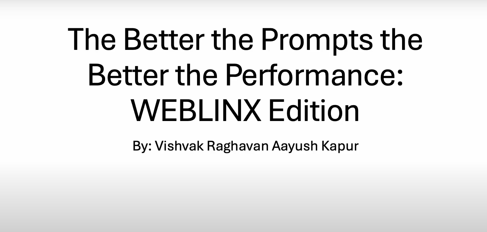

# PrompGent
Built on top of [Weblinx](https://mcgill-nlp.github.io/weblinx/). Enhanced prompting for the agent to navigate web tasks. This was a collaboration between @kpraays (Aayush Kapur) and @vishvak11 (Vishvak Raghavan).


### Description
Conversational web navigation poses a formidable challenge as digital agents navigate web browsers, responding to user instructions across multi-turn dialogues to accomplish real-world tasks. The introduction of WEBLINX, a robust benchmark derived from 2300 expert demonstrations, has provided an invaluable platform for training and evaluating agents across diverse scenarios.

Recent advancements in prompting have highlighted LLMs' prowess as adept few-shot and zero-shot reasoners. Furthermore, guiding LLMs with longer-term historical context has shown promise in enhancing performance.

Our study delves into how advanced prompting methods impact text-only decoder capabilities in conversational web navigation. By evaluating on the WEBLINX benchmark, we demonstrate that integrating the main conversation topic into the prompt offers enhanced contextual guidance, leading to more accurate actions. Furthermore, we observe that smaller LLMs struggle as zero-shot and few-shot reasoners in conversational web navigation. Our findings highlight the need for a nuanced approach to prompt designs, considering both the capabilities and limitations of different model sizes.

More details available: View the full report [here](./docs/report/report.pdf).

### Requirements
We implemented three experiments each with a different approach to enhance the prompt. This was done on top of the base code supplied by webLinx paper. To run our experiments, all the requirements needed for webLinx need to be installed.

Our experiments were run on the compute Canada cluster so the package names in the [requirements](./requirements.txt) file depict the same.

More details on setting up the environment can be found here: [setup docs](./docs/setup.md)

### Usage
- Setup the webLinx package as described [here](https://github.com/McGill-NLP/WebLINX).
  - or clone our repository and install all the dependencies for webLinx manually.
- Download the complete dataset for webLinx. (get data [here](https://huggingface.co/datasets/McGill-NLP/WebLINX))
  - To download data with a custom huggingface cache location and not using symlinks. Check [this](./scripts/data_process/get-data-scripts/get-cand-chat-data.py).
  - It is assumed all these commands will be executed from the modelling directory.
  - Get candidates, data and chat files using the following:
```python
from huggingface_hub import snapshot_download

# we will give a custom cache location for 

# candidates files
snapshot_download(
    repo_id="McGill-NLP/WebLINX-full", 
    repo_type="dataset",
    allow_patterns="candidates/*.jsonl", 
    local_dir="./wl_data"
    )

# data files
snapshot_download(
    repo_id="McGill-NLP/WebLINX-full", 
    repo_type="dataset", 
    allow_patterns="data/*.csv", 
    local_dir="./wl_data"
    )

# chat files
snapshot_download(
    repo_id="McGill-NLP/WebLINX-full", 
    repo_type="dataset", 
    allow_patterns="chat/*.csv", 
    local_dir="./wl_data"
    )
```
  - To speed up the data download process, you can skip screenshot and video files per demonstration since we only considered text only models for our experiments.
  - Get demo files using the following:
```python
from huggingface_hub import snapshot_download

# custom list of demos without screenshots and videos
demo_names = []

patterns = [f"demonstrations/{name}/*" for name in demo_names]
snapshot_download(repo_id="McGill-NLP/WebLINX-full", repo_type="dataset", local_dir="./wl_data", allow_patterns=patterns, ignore_patterns=["*.png", "*.mp4"])

# if all demos without screenshots and videos
snapshot_download(repo_id="McGill-NLP/WebLINX-full", repo_type="dataset", local_dir="./wl_data", ignore_patterns=["*.png", "*.mp4"])
```  
- We have separate evaluation files per experiment for each of the model. So they can directly be run once all the requirements are setup.
  - You will have to change the file name and the split name depending on the experiment.
  - The experiments can be run using following:
```
python -m llama.eval +variant="ft_1.3b" eval.split=valid
```


- More details pertaining to usage here: [usage docs](./docs/usage.md)


### Results
- These were our [experiments](./experiments/README.md):
  - Incorporating evolving main context of conversation to prompt
  - Zero-shot CoT
  - Few-shot CoT
- We aggregate the results for the two models, Sheared-LlaMa-1.3B and Flan-T5-780M here: [results](./results/tables.md)

### Explanation
[](https://youtu.be/ccdDbl0sQjY)

### Contribution
It was a collaboration between the following group members:
- Aayush Kapur: @[kpraays](https://github.com/kpraays)
- Vishvak Raghavan: @[vishvak11](https://github.com/vishvak11)
- More details under section: [contribution](./docs/contribution.md)


